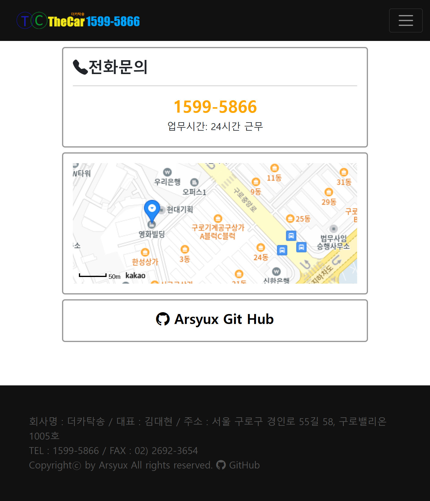

# thecar-springboot-project
스프링부트를 사용한 자동차 탁송사이트

## 🖥️ 프로젝트소개
자동차 탁송 사이트들을 참고하여 만든 자동차 탁송 사이트입니다.

## 🕰️ 개발 기간
2023.08.14 ~ 2023.12.15

### 🧑‍🤝‍🧑 개발 인원
혼자서 공부하며 개발하고 있습니다.

### ⚙️ 개발 환경
- **Language** : Java 11
- **IDE** : STS4
- **Framework** : SpringBoot 2.6.7
- **Database** : MariaDB 10.6.12
- **ORM** : Mybatis 2.2.0

## 📌주요 기능

### 회원 가입, 수정, 탈퇴
- ID, 이메일, 휴대폰 중복체크 구현
- 내 정보 페이지에서 회원 정보를 수정 및 탈퇴할 수 있음.
- 유효성 검사 적용

### 아이디, 비밀번호 찾기
- 개인정보를 통해 아이디를 찾을 수 있게 구현
- 비밀번호의 경우 재설정하게 구현

### 로그인, 로그아웃
- 스프링 시큐리티를 통한 로그인, 로그아웃 구현

### 메인 화면
- 카카오 지도 api를 사용하여 업체의 위치를 표시하였음.

 

### 메인화면 (반응형)

 

### 게시글 작성, 수정, 삭제
- 카카오 주소 api를 사용하여 출발지 주소, 도착지 주소를 설정할 수 있음.
- 여러개의 첨부 파일 업로드 기능 구현
- 게시글 작성시 DB에 게시글 정보를 업로드 후 파일 정보를 삽입함.
- 게시글 수정시 PC데이터 및 DB데이터를 삭제하고 첨부파일을 새로 업로드함.
- 게시글 삭제시 PC데이터 및 DB데이터 삭제
- 유효성 검사 적용
